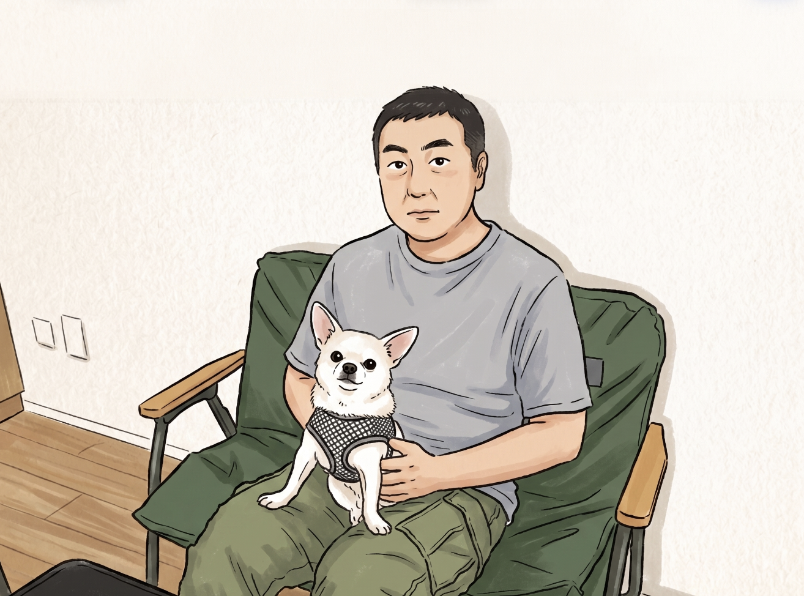

# 🧾 職務経歴書・スキルシート

> **[📄 概要版を見る](./short)**

---

  
  

    
未整備・複雑化したクラウド / インフラ環境を整理・改善・標準化するシニアエンジニアとして活動しています。

    
GCP / AWS を中心に、インフラ担当不在からの立ち上げや、属人化した運用環境の整理・標準化を担ってきました。Terraform による IaC 化・SRE 的な改善（監視・コスト・IAM・障害対応）まで、20 年以上の経験をもとに設計から運用定着まで手を動かして推進します。スタートアップや成長フェーズの組織で「技術的に正しい方向へ整えながら前へ進める」役割を担っており、日本をよくしようと挑戦しているチームをインフラ・クラウド基盤の側面から支えていきたいと考えています。

    
チワワのちわ丸と暮らしており、毎日癒されています。趣味は珈琲焙煎で、豆の産地・焙煎度・抽出方法をあれこれ試行錯誤しながら楽しんでいます。

    
少しでも会話のきっかけになれば嬉しいです。よろしくお願いします！

  

---

## 目次

- [1. 職務要約](#1-職務要約)
- [2. コアスキル・強み](#2-コアスキル強み)
- [3. 技術スキル](#3-技術スキル)
- [4. 対応可能業務・希望案件](#4-対応可能業務希望案件)
- [5. フリーランスとしての支援実績](#5-フリーランスとしての支援実績)
- [6. 正社員での職務経歴](#6-正社員での職務経歴)
- [7. 資格](#7-資格)

---

## 1. 職務要約

未整備・複雑化したクラウド / インフラ環境を、技術的に整理・改善・標準化できるシニアエンジニアです。インフラ担当不在からの立ち上げや、属人化・混在した運用環境の整理立て直しを担いながら、Terraform / IaC 標準化・SRE 的な運用改善（監視・コスト・IAM・障害対応）まで、自分で手を動かして一気通貫で推進します。「管理・調整専業」でも「一点突破型のスペシャリスト」でもなく、複雑な状況を整理しながら技術的に正しい判断で前へ進める、そういうポジションを担ってきました。

スタートアップや成長フェーズの組織で、インフラ担当が不在の段階からの立ち上げや、複数プロダクト・チームが混在してカオス化した環境の整理立て直しを担いながら、開発チームが機能開発に集中できる基盤をつくる仕事をしてきました。属人化・権限管理・コスト可視化といった「今急がないが後で必ず困る領域」に早めに手を入れる。そのバランス感覚と実行力が、これまで一緒に働いたチームから評価されてきた部分です。

**直近実績：** GCP 環境の基盤整備を担当し、開発チームの運用負荷を削減。クラウド費用の最適化で新規投資余力を確保しつつ（月額 10％以上削減・不要リソース約 20％削除）、IaC 化・IAM 整備・バックアップ・障害対応体制の整備を実現。

**経験規模：** 大規模通信インフラ（ソフトバンク）、約 200 サービス規模の AWS 移行推進（BIGLOBE・CCoE）、IoT シェアリングサービスのクラウド基盤（Luup）、成長フェーズの Web サービス基盤支援（フリーランス）。

Claude Code / GitHub Copilot / Cursor など AI 開発ツールを日常的に活用しており、新技術への適応と開発効率化にも積極的に取り組んでいます。非エンジニアや経営層とのコミュニケーションにも対応でき、少人数体制でもスピード感を持って動ける点が特徴です。

[▲ 目次に戻る](#目次)

---

## 2. コアスキル・強み

**【コア領域】**

- **クラウド環境の整理・改善・標準化（GCP / AWS）：** 未整備・混在した環境を調査し、リソース適正化・IAM 整理・コスト削減・監視整備を一気通貫で担当。直近案件でクラウド費用を最適化し新規投資余力を確保（月額 10％以上・不要リソース 20％削除）
- **IaC / Terraform によるコード化と属人化解消：** Terraform を用いた新規リソース作成・既存コード修正・インフラのコード化に対応。「誰でも理解できる基盤」への標準化を推進（Luup での実務経験あり）
- **SRE / 運用改善の整備：** 監視・アラート・バックアップ・障害対応フロー・コスト可視化・権限管理をセットで整備し、開発チームが開発に集中できる運用体制を構築

**【対応可能 / 実務経験あり】**

- **AWS 設計・構築・運用改善：** Luup での S3・Lambda・Kinesis・CloudWatch を用いたリアルタイムデータ基盤の実務構築・運用、BIGLOBE での CCoE 活動・約 200 サービスの AWS 移行推進・設計レビューを経験
- **生成 AI 基盤の設計・導入：** Azure OpenAI / Dify / RAG を活用した社内の業務効率化ツール設計・導入。Claude Code / GitHub Copilot / Cursor などを日常的に活用し、開発の生産性向上への取り組みを継続
- **クラウドコスト最適化：** 不要リソース整理・リソースサイズ適正化による新規投資余力の確保、月次モニタリング設計、経営層への方針説明

**【付加価値】**

- **技術推進・関係部署への定着：** 非エンジニアや経営層にも伝わる資料・手順書を作成し、関係部署を巻き込みながら運用定着まで伴走。Luup および BIGLOBE にて TechBlog 立ち上げ・編集長として技術発信を推進

[▲ 目次に戻る](#目次)

---

## 3. 技術スキル

| 分野 | 主な経験・技術 | 経験の深度 |
| --- | --- | --- |
| GCP | Cloud Run, Cloud SQL, Cloud Storage, Cloud Build, Pub/Sub, Workflows, BigQuery, Artifact Registry, Secret Manager, Cloud Scheduler, Firebase, IAM, Cloud Monitoring | 直近案件での運用改善、調査、設定見直し、監視・コスト整備を主導 |
| AWS | EC2, S3, IAM, VPC, Route 53, Lambda, Bedrock, RDS, CloudWatch, CloudFormation, AWS Organizations, Cost Explorer, AWS Budgets, WAF, ELB / ALB, Kinesis, SNS | Luup での実務構築（S3・Lambda・Kinesis・CloudWatch）、BIGLOBE での CCoE / AWS 移行支援 / 設計レビューを経験 |
| Azure / Microsoft | Azure OpenAI, Entra ID, Azure VM, Microsoft 365, Teams | 社内 IT、ID 管理、生成 AI 活用、問い合わせボット導入で利用 |
| SRE / 運用 | Cloud Monitoring, CloudWatch, Datadog, Terraform, GitHub Actions, 監視設計、 アラート設計、 バックアップ設計、 障害対応、 運用手順書作成、 リリース自動化、 SLI / SLO | 監視・アラート、オンコール、バックアップ、障害対応手順、運用改善で利用 |
| DB | MariaDB, Cloud SQL, RDS, スロークエリ調査、 インデックス整理、 レプリカ構成検討、 フェイルオーバー検討 | DB 負荷対策、ログ確認、接続数調査、構成比較、運用手順整備を経験 |
| 情シス | Microsoft 365, Teams, Slack, Jira, Confluence, Miro, ChatWork, Google Workspace, Notion, PC / Mac 管理、 SaaS 管理、 アカウント管理、 ベンダー管理、 ヘルプデスク | 少人数情シス部門の運用改善、SaaS 棚卸し、アカウント管理、コスト見直しで経験 |
| 生成 AI / LLM | OpenAI API, Azure OpenAI, Google Gemini, AWS Bedrock, Claude, Dify, RAG, Cohere, Cursor, GitHub Copilot, Claude Code, OpenAI Codex, Kiro | 社内問い合わせボット、FAQ・文書検索、Dify ワークフロー、RAG 構成、業務効率化で利用 |

[▲ 目次に戻る](#目次)

---

## 4. 対応可能業務・希望案件

インフラ担当不在からの立ち上げや、属人化・混在したクラウド環境の整理立て直し・Terraform 化・SRE 的な改善など、「整理と標準化を進めたいフェーズ」の企業に対して、設計から運用定着まで一気通貫で支援します。

### クラウド基盤 / SRE / IaC

- スタートアップ・成長企業のクラウド基盤設計・構築支援（GCP / AWS / Azure）
- インフラ担当不在の段階からの立ち上げ、カオス化した環境の整理・標準化
- Terraform / IaC によるインフラのコード化・属人化解消・スケーラブル化
- Cloud Run / Cloud SQL / Cloud Storage 等を用いた GCP 環境の構築・運用改善
- CI/CD・リリース自動化・運用負荷の高い作業の自動化
- 監視・アラート・バックアップ・障害対応フローの整備（開発チームの運用負荷削減）
- 新規クラウド環境の設計・構築から既存環境の継続的改善まで一気通貫で対応

### 生成AI / RAG / 開発効率化

- Azure OpenAI / OpenAI API / Dify を活用した業務効率化ツールの設計・導入
- 社内問い合わせボット、FAQ・文書検索、Teams / Slack 連携
- RAG 設計、プロンプト設計、利用ルール・運用設計
- Claude Code / GitHub Copilot / Cursor などを活用した開発効率化支援

### DB / 業務システム運用

- スロークエリ調査、インデックス整理、DB 負荷調査
- 接続集中、バックアップ、レプリカ、フェイルオーバー構成の検討
- アクセス増加・事業拡大に対応できる構成見直しと手順整備

### IAM / セキュリティ（事業スピードを維持するための整備）

- 開発速度を落とさない最小権限設計・IAM 棚卸し・権限付与・削除フロー整備
- 共有範囲、公開範囲、機微情報管理の見直し
- 鍵・トークン管理、操作ログ確認、管理ルール整備

### クラウドコスト最適化（新規投資余力の確保）

- 不要リソース・過剰スペックの整理による新規投資余力の確保
- クラウド費用・SaaS ライセンス・通信回線等の可視化と継続モニタリング設計
- 経営層向けのコスト削減方針整理・説明

### 情シス / 社内IT

- PC・SaaS・アカウント・社内ネットワーク・ベンダー管理
- ヘルプデスク、入退社対応、社内 IT ルール整備
- 少人数情シス部門の業務整理・運用改善・ドキュメント化

[▲ 目次に戻る](#目次)

---

## 5. フリーランスとしての支援実績

### ■[業務委託］GCPクラウド運用最適化

| | |
|:---|:---|
| **期間** | 2024 年 10 月〜 |
| **技術スタック** | GCP, Cloud Run, Cloud SQL, Cloud Storage, Cloud Build, Pub/Sub, Workflows, IAM, Cloud Monitoring, BigQuery, Artifact Registry, Secret Manager, Cloud Scheduler, Firebase |
| **体制** | フロントエンド、バックエンド、CTO と共同 |
| **役割** | クラウド運用改善、SRE、IAM 整理、バックアップ設計、監視・コスト可視化、セキュリティ確認、障害復旧手順整備 |
| **規模** | 建設業向け Web サービスのプロダクト基盤 |

#### 概要

建設業向け Web サービスを提供する企業にて、GCP 基盤の継続的改善を担当。まず既存環境を全体的に調査し、「どのリソースが過剰か・どこがリスクか・何から手をつけるべきか」を技術的に判断したうえで改善優先度を設計しました。

Cloud Run / Cloud SQL / Cloud Storage を中心にリソース利用状況の可視化・適正サイズ化・IAM 整理を進め、バックアップ・リストア手順・監視・コスト通知・障害復旧体制を整備。単なる設定変更にとどまらず、月次でコスト変動を検知できる運用フロー設計まで含め、継続的改善サイクルを確立しました。CTO・フロントエンド・バックエンド担当者と連携し、改善方針の説明・合意形成・実装・訓練まで一気通貫で推進しました。

#### 主な対応

- Cloud Run / Cloud SQL / Cloud Storage の利用状況確認と適正サイズ化
- Artifact Registry の不要イメージ、Cloud Scheduler / Workflows / Pub/Sub の利用状況確認
- 多リージョン配置、復元可能な削除、バックアップ手順の検討
- Cloud Build → Pub/Sub → Workflows の連携
- Cloud Run のトラフィック切替自動化
- IAM 棚卸し、最小権限化、付与・削除フローの明確化
- サービスアカウント、Secret Manager、Cloud Run 実行権限、Cloud SQL 接続権限の確認
- ダッシュボード整備、月次コストの Slack 通知
- 機微な文書・データの国内リージョン配置
- 共有範囲の適正化、閲覧ログ記録
- セキュリティ観点での設定確認、過剰権限・危険操作につながる設定の見直し
- バックアップ対象、取得手順、リストア手順の見直し
- 障害復旧時の手順書作成、復旧訓練の実施

#### 成果

> クラウド費用の最適化で **新規投資余力を確保**（月額10%以上削減）／ 不要リソース **約20%削除** ／ IAM最小権限化 ／ バックアップ・障害対応体制整備

- クラウド費用を最適化し、新規機能開発・拡張への投資余力を確保（月額 10％以上）
- 不要リソースを約 20％削除し、管理対象を整理・開発チームの認知負荷を軽減
- IAM 権限の棚卸しと最小権限設計により、開発スピードを維持しながらリスクを低減
- バックアップ・リストア手順を整理し、障害時の迅速な復旧が可能な体制を整備
- 障害復旧手順書と復旧訓練により、属人的な障害対応を誰でも動ける運用へ改善
- コスト・監視・バックアップ・権限管理の運用ルールを整備し、継続的改善サイクルを確立

---

### ■[業務委託］DB負荷対策・運用改善

| | |
|:---|:---|
| **期間** | 2023 年 7 月〜 |
| **技術スタック** | MariaDB, さくらのクラウド、 Web サーバー, PHP, syslog, ログ監視 |
| **体制** | 代表 / 経営者と直接やり取りし、社内エンジニアと連携 |
| **役割** | DB 負荷調査、スロークエリ調査、運用改善、構成案比較、手順書整備 |
| **規模** | 全国の自動車ディーラーが利用する業務システム。DB5 台、アクセス増加時期は土日 |

#### 概要

全国にある自動車ディーラーが利用する業務システム / Web アプリケーション基盤において、事業拡大に伴うアクセス増加に対応できる基盤整備を目的に、MariaDB を中心とした DB 負荷対策、レスポンス遅延調査、Web サーバー / PHP / DB の同時処理数整理、監視・ログ確認の仕組みづくりを担当。DB5 台構成の環境を対象に、土日のアクセス増加も踏まえた設定見直しや障害リスク低減を進めました。

#### 主な対応

- スロークエリ調査、インデックス整理
- MariaDB 設定確認、max_connections 調査、メモリ使用量確認
- Web サーバー / PHP 側の同時処理数確認
- バックアップと通常運用の同時実行検証
- 接続集中時の再現、max_connections 到達時の対処案提示
- レプリカ構成、フェイルオーバー、プロキシ構成の比較
- 監視・アラートしきい値の整備
- MariaDB ログ、スロークエリログ、syslog、サーバーリソース、ロードアベレージ、接続数、エラー件数を確認する運用整理
- 障害対応手順書、切り戻し手順の作成
- 経営者向け説明・提案

#### 成果

- MariaDB 5 台構成におけるレスポンス遅延・接続集中の原因を調査し、事業継続を阻害するボトルネックを特定
- スロークエリ、インデックス、max_connections、Web / PHP / DB の同時処理数を横断的に確認し、負荷発生時の確認観点を標準化
- 土日などアクセス増加時に対応できる設定見直し方針と運用手順を作成
- バックアップ実行時の負荷影響を検証し、通常運用との衝突リスクを整理
- レプリカ構成、フェイルオーバー、プロキシ構成の比較資料を作成し、将来のスケールアップに向けた選択肢を経営者に提示
- 監視項目、ログ確認手順、障害時の切り戻し手順を整備し、障害対応を誰でも動ける体制へ改善

---

### ■[業務委託］社内情シス業務全般

| | |
|:---|:---|
| **期間** | 2023 年 2 月〜2023 年 9 月 |
| **技術・対象** | 社内 LAN, PC, サーバー, 周辺機器、 SaaS, アカウント、 ベンダー管理 |
| **体制** | 情報システム部の外部支援 / 情シス改善コンサルとして参画。参加当初の情シス体制は正社員 4 名 |
| **役割** | 情シス部門の外部支援、情シス改善コンサル、ベンダー折衝、機器官理、ヘルプデスク、運用改善、予算・コスト最適化支援 |
| **規模** | 従業員約 200 名、管理 PC 従業員数分、SaaS は Microsoft 365 / Teams / Slack / Jira / Confluence / Miro / ChatWork など |

#### 概要

業務委託として情報システム部門を支援。従業員約 200 名規模の組織において、社内ネットワーク、機器官理、ベンダー折衝、ヘルプデスク、SaaS・アカウント管理、予算・コスト最適化など、社内 IT 運用全般を担当しました。

参画当初は、問い合わせ対応、アカウント発行・削除、SaaS 管理、費用管理、手順書整備、情シスメンバー間連携に課題がありました。これに対し、タスク整理、定例会設計、SaaS 棚卸し、ベンダー見積の妥当性確認、コスト削減交渉、手順書作成を進め、情シス業務の可視化と運用改善を推進しました。

#### 主な対応

- 問い合わせ対応の滞留状況確認、タスク整理、対応状況の可視化
- 情シスメンバー間の定例会設計、進捗確認、役割分担整理
- 外部ベンダーへの発注管理、提案内容・価格の妥当性評価
- SaaS 利用状況の棚卸し、ライセンス利用状況の確認
- Microsoft 365 E5 から E3 への見直し検討
- 050 番号利用とスマートフォン貸与の費用比較、およびスマートフォン貸与への切り替え実行
- クラウド費用の確認、削減余地の洗い出し
- PC、サーバー、周辺機器のリース契約管理
- アカウント発行・削除、SaaS 管理、問い合わせ対応に関する手順書・運用ドキュメント作成
- 経営層に対する情シス課題、コスト削減方針、SaaS / アカウント管理課題の報告・提案

#### 成果

- 少人数体制の情シス部門において、タスク整理・定例会設計・役割分担見直しを行い、業務進行を改善
- SaaS ライセンス、Microsoft 365、通信回線、クラウド費用などのコスト削減余地を洗い出し
- 050 番号運用からスマートフォン貸与への切り替えにより、通信コストの適正化を推進
- アカウント発行・削除、SaaS 管理、問い合わせ対応の手順書を整備し、属人化を軽減
- 経営層に対して情シス課題、改善方針、コスト削減方針を報告・提案
- 業務委託での支援実績を評価され、情報システム部門責任者として正社員参画する流れにつながった

---

### ■[業務委託］SEO向け自動ブログ作成システム

| | |
|:---|:---|
| **期間** | 2024 年 12 月〜2025 年 3 月 |
| **技術スタック** | OpenAI API, Dify, RAG, Google Drive, WordPress, Markdown |
| **体制** | 個人顧客向けに、1 名で企画・設計・実装・提供 |
| **役割** | 企画、設計、実装、プロンプト設計、RAG 構成、WordPress 投稿フロー作成 |

#### 概要

Web 制作を行う顧客向けに、RAG を活用した自動ブログ作成システムを企画・設計・開発。顧客の既存 Web ページ、Google Drive 上のキーワード一覧、SEO 調査情報を参照し、記事テーマ、タイトル、見出し、メタディスクリプション、本文を自動生成し、WordPress へ投稿する流れを構築しました。

#### 主な対応

- OpenAI API と Dify を用いたブログ生成フローの設計・構築
- 顧客の既存 Web ページ、Google ドライブ上のキーワード一覧、SEO 調査ツール情報を検索対象とした RAG 構成の設計
- SEO キーワードをもとにした記事テーマ作成、関連情報検索、競合ブログ有無の確認
- タイトル、見出し、メタディスクリプション、本文の自動生成
- WordPress への Markdown 形式での投稿フロー作成
- 実際の質問・生成結果を用いた評価・改善サイクルの実施

#### 成果

- 記事テーマ作成、構成作成、本文生成、投稿準備の一連の作業を自動化
- SEO 向けコンテンツ作成業務の効率化を支援
- 顧客が継続的に記事作成を行いやすい状態を構築
- 生成 AI と RAG を活用した業務システムとして実装・提供

[▲ 目次に戻る](#目次)

---

## 6. 正社員での職務経歴

### ■[正社員］株式会社KDDIウェブコミュニケーションズ

| | |
|:---|:---|
| **期間** | 2023 年 10 月〜2024 年 11 月 |
| **部署 / 役職** | 情報システム部 / ゼネラルマネージャー |
| **主な領域** | 情シス組織立て直し、社内業務効率化、クラウド運用、基幹システム運用、生成 AI 活用 |
| **技術スタック** | AWS, Azure, Azure OpenAI, Entra ID, Microsoft 365, Teams, Slack, Jira, Confluence, Miro |
| **体制** | 情報システム部の管理者として、社員 6 名・派遣 1 名規模のチームを統括 |

#### 概要

株式会社 KDDI ウェブコミュニケーションズにて、情報システム部の責任者として、生成 AI 基盤の設計・導入、社内クラウド環境の整備、IT 統制の強化を技術面から主導しました。もともと業務委託として同社の IT 支援に関与していましたが、組織改革を権限を持って進めてほしいという要請を受け正社員として参画。6 名チームのマネジメントと並行して、自ら設計・構築に関与する役割を担いました。

基幹システム（顧客情報管理・契約・課金）については、設計の選択肢整理・ベンダーとの仕様調整・優先度判断を担当。コード実装よりも「何をどう作るか」の技術判断とプロセス推進が主な貢献です。

#### 担当業務

**生成 AI 基盤の設計・構築（主導）**
- Azure OpenAI を活用した社内問い合わせボット・FAQ 文書検索・Teams / Slack 連携の設計・構築
- RAG 構成の設計：社内文書の分割・タグ付け・検索・回答フローの設計と実装
- 回答精度検証：代表質問リストと期待回答の差分確認サイクルを設計
- セキュリティ・コスト・利用権限の方針整理、プロンプト設計ガイド・利用ルールの文書化
- 全社向け生成 AI 利用基盤の確立（利用方針・禁止事項・コスト管理）

**クラウド環境・IT 統制**
- 社内利用 AWS / Azure 環境の整備（Entra ID、Azure VM 含む）
- Microsoft 365、Jira、Confluence など社内 IT ツールの統制・利用ルール見直し
- 社内 OA 運用（アカウント発行・削除・SaaS 管理）の標準化・手順書整備

**組織・推進**
- 情報システム部（社員 6 名・派遣 1 名）のマネジメント・メンバー育成
- 基幹システムの運用課題整理・開発推進・ベンダー調整・優先度判断

#### 成果

- Azure OpenAI を社内にいちはやく導入し、問い合わせボット・FAQ 文書検索・Teams / Slack 連携を構築。ナレッジ活用基盤を確立し、問い合わせ対応コストを削減
- 生成 AI 利用ルール・セキュリティ・コスト管理を整備し、全社が安全に利用できる基盤を確立
- 社内 IT ツールの統制・標準化により、属人化しやすい OA 業務を誰でも対応できる状態へ改善
- 情報システム部の体制整備・メンバー育成・委託先管理を通じて、継続的に改善が回る組織状態づくりに貢献

---

### ■[正社員］株式会社Luup

| | |
|:---|:---|
| **期間** | 2022 年 1 月〜2023 年 7 月 |
| **部署 / 役職** | ソフトウェアデベロップメント部 / IoT・SRE エンジニア、コーポレート IT 兼任 |
| **主な領域** | IoT / 通信基盤、SRE、クラウド運用改善、社内情シス運営 |
| **技術スタック** | GCP, Cloud Run, Cloud SQL, BigQuery, Cloud Storage, Pub/Sub, Firebase, Cloud Functions, IAM, Cloud Monitoring, AWS, S3, Lambda, Kinesis, CloudWatch, SNS, Datadog, Terraform, Google Workspace, Slack, Notion |
| **体制** | 所属チームは 5 名程度。フロントエンド、バックエンド、iOS / Android アプリ、IoT チーム、車両開発チームなどと連携 |

#### 概要

株式会社 Luup にて、電動キックボードシェアリングサービスの急成長を支える IoT / 通信基盤・クラウド基盤の構築と運用改善を担当しました。IoT 機器からの位置情報・解錠・施錠・バッテリー・走行データの収集・保存・分析基盤を GCP / AWS で設計・実装し、Terraform による IaC 化で属人化を排除。Datadog / CloudWatch を組み合わせた監視設計では、「どのレイヤーで何を観測するか」の判断から担い、アラート条件・オンコール自動化まで一気通貫で構築しました。

#### 担当業務

- GCP / AWS を用いたサービス基盤の構築・運用
- Cloud Run, Cloud SQL, BigQuery, Cloud Storage, Pub/Sub, Firebase, Cloud Functions, IAM, Cloud Monitoring などを用いた GCP 環境の開発・運用
- S3, Lambda, Kinesis, CloudWatch, SNS などを用いた AWS 環境の開発・運用
- Terraform による既存コード修正、新規リソース作成、レビュー
- IoT データの収集・保存・分析・可視化
- 位置情報の取得・保存、通信状態の監視、障害調査
- IoT 通信、API 応答、エラー率、レイテンシなどを対象にした監視項目・アラート条件の整理
- Datadog、AWS CloudWatch、Amazon Connect、Slack を組み合わせたオンコール自動化
- AWS / GCP / Datadog のコスト管理・削減
- Google Workspace、Slack、Notion、各種 SaaS アカウントなどの社内 OA 運営管理
- PC / Mac 管理、入退社対応、ヘルプデスク対応

#### 成果

- 電動キックボードシェアリングサービスの急成長を支える IoT / 通信基盤・サーバー運用を担い、プロダクトのスケールアップに貢献
- IoT データの収集・保存・分析・可視化、通信状態監視、障害調査を通じて、成長とともに増えるデータ量・IoT 接続数に対応できる基盤を維持
- IoT 通信・サーバー・アプリケーションの状態を横断して確認できる監視体制を構築し、開発チームの障害対応速度を向上
- Datadog / CloudWatch を活用した監視自動化・オンコール自動化により、エンジニアが開発に集中できる運用体制を整備
- Terraform による IaC 化とクラウドコスト管理により、スケールしても破綻しない継続的な基盤づくりを推進
- TechBlog 立ち上げ・編集長として、技術発信と組織の知見共有・採用ブランディングに寄与

---

### ■[正社員］ビッグローブ株式会社

| | |
|:---|:---|
| **期間** | 2018 年 12 月〜2022 年 1 月 |
| **部署 / 役職** | 技術本部 / 肩書・役職なし |
| **主な領域** | AWS 移行支援、CCoE、社内 AWS コンサル、技術組織活性化 |
| **技術スタック** | AWS, EC2, VPC, IAM, S3, RDS, Route 53, CloudWatch, CloudFormation, AWS Organizations, Cost Explorer, AWS Budgets, Lambda, WAF, ELB / ALB |
| **体制** | 10 名程度のチームで、複数のサービス運営部署と連携 |

#### 概要

ビッグローブ株式会社にて、CCoE / クラウド推進担当として、法人向け・個人会員向けを含む約 200 サービスの AWS へのリフト&シフトを推進。複数の開発チームから持ち込まれる VPC 設計・IAM 権限設計・RDS 構成・コスト見積もり・WAF / LB 構成などの技術相談に対し、「このアーキテクチャで本当に問題ないか」を判断して設計レビュー・方針整理を担当しました。単なる承認窓口ではなく、トレードオフを説明したうえで各チームの意思決定を後押しする役割を担っていました。

#### 担当業務

- オンプレミスから AWS へのリフト&シフトに伴う CCoE / クラウド推進業務
- AWS 環境の設計・構築および移行に伴う技術支援
- EC2, VPC, IAM, S3, RDS, Route 53, CloudWatch, CloudFormation, AWS Organizations, Cost Explorer, AWS Budgets などを用いた AWS 環境整備
- 複数のサービス運営部署からの AWS 活用相談、設計レビュー、設計方針整理、社内調整
- VPC 設計、負荷設計、EC2 構成、IAM 権限設計、RDS 設計、S3 活用、Lambda 活用、WAF / LB 構成などの相談・レビュー
- コスト見積もり、セキュリティ設計に関する相談・レビュー
- 移行方針、利用ガイドライン、クラウド活用ルールの整備
- AWS プロフェッショナルサービスとの技術相談・情報連携
- TechBlog の立ち上げ、編集長としての運営

#### 成果

- 約 200 サービスの AWS 移行を推進し、複数の開発チームが自律的にクラウドを活用できる基盤・ガイドラインを整備
- 各サービス部門の AWS 設計レビュー・相談対応を担い、開発チームがスピード感を持ってクラウドを活用できる環境を後押し
- VPC 設計・IAM 権限設計・コスト見積もり・セキュリティ設計のレビューを通じて、開発スピードを落とさない安全なクラウド活用を推進
- AWS プロフェッショナルサービスとの連携により、外部の最新知見を取り込みながら社内のクラウド活用レベルを底上げ
- TechBlog 立ち上げ・編集長として、社内外への技術発信とエンジニア組織の活性化・採用ブランディングに寄与

---

### ■[正社員］ソフトバンク株式会社

| | |
|:---|:---|
| **期間** | 2001 年 4 月〜2018 年 10 月 |
| **部署** | ネットワーク検証部、サービス開発系部門ほか |
| **主な領域** | 携帯電話コアネットワーク・無線ネットワークの開発検証、サービス共同開発、MVNO 接続受け入れ |
| **技術・対象** | 携帯電話コアネットワーク、無線ネットワーク、交換機ソフトウェア、スマートフォン端末、通信プロトコル、RFC、3GPP |
| **体制** | 10 名程度のチーム。開発・運用・保全・監視などの技術系部署に加え、営業、商品企画、サービス企画、技術規格関連部署、他通信キャリアとも連携 |

#### 概要

携帯電話コアネットワークおよび無線ネットワークの開発検証を担当。交換機ソフトウェア、新機種スマートフォン、ネットワーク設備の接続・動作検証、プロトコル解析、ログ解析、RFC / 3GPP に基づく仕様確認を行いました。

また、他通信キャリアとの共同サービス開発、MVNO 事業者向けネットワーク接続仕様の開発・受け入れ対応にも関与。大規模通信インフラにおける品質管理、障害予防、関係部署をまたいだ技術調整を経験しました。現在の SRE / 運用改善においても、仕様・ログ・プロトコルをもとに原因を切り分ける調査力の土台になっています。

#### 担当業務

- 携帯電話コアネットワーク、無線ネットワークの開発検証
- 交換機ソフトウェア導入前の動作検証
- 新規スマートフォン発売前のネットワーク接続・動作検証
- 通信プロトコル解析、ログ解析
- RFC / 3GPP を読み解き、ネットワークやスマートフォンが仕様通りに動作するかを確認
- NTT ドコモ、au など他通信キャリアとの共同サービス開発
- MVNO 事業者向けのネットワーク接続受け入れ仕様の開発
- MVNO 事業者からの接続受け入れ対応
- 開発・運用・保全・監視、営業、商品企画、サービス企画、技術規格関連部署との調整

#### 成果

- 数千万人規模の携帯電話利用者を支える通信サービスの品質確保に関与
- 通信プロトコル解析、ログ解析、仕様確認を通じた技術調査力を経験
- 交換機ソフトウェア、新規スマートフォン、ネットワーク設備のリリース前検証を担当
- 他通信キャリアとの共同サービス開発において、会社を超えた技術調整・仕様調整を経験
- MVNO 接続受け入れにおいて、ネットワーク仕様開発から接続対応まで担当
- 複数部署をまたぐ案件推進・調整を実施

[▲ 目次に戻る](#目次)

---

## 7. 資格

- AWS 認定ソリューションアーキテクト – アソシエイト
