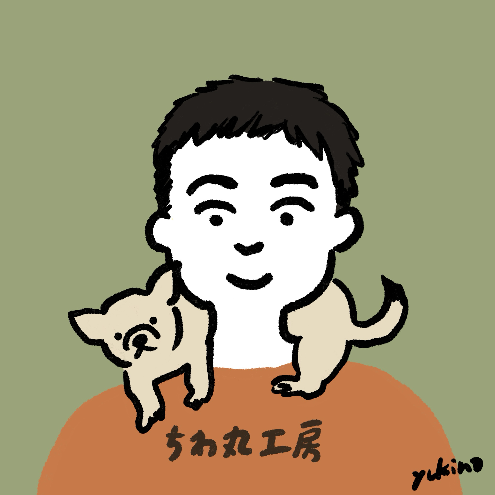

# 職務経歴書・スキルシート（概要版）

[詳細版はこちら](./detail)

**AWS / GCP の既存環境改善を、設計から実装まで担う SRE エンジニア**

クラウド環境の現状調査、改善優先度の整理、構成設計・実装、監視・IAM・バックアップ・障害対応手順の整備を担当します。開発担当者と方針を調整し、設計判断の根拠と操作手順を文書に残す支援をしてきました。

[詳細な職務経歴・技術一覧を見る](./detail)

## 代表実績

### GCP クラウド運用最適化｜2024 年 10 月〜

建設業向け Web サービスの既存環境を調査し、改善優先度を整理。CTO・開発担当者と連携し、Cloud Run / Cloud SQL / Cloud Storage を中心に構成見直しと運用手順整備を担当。

- 費用最適化に向けたリソース利用状況の調査、不要リソースの確認
- IAM 棚卸し・最小権限化、バックアップ・リストア手順、障害復旧手順と復旧訓練
- Cloud SQL の WAL 保持に伴うストレージ使用量増加を調査し、関係者と連携して対応。Hasura の接続数増加の原因調査・社内報告用草案の作成

### 睡眠解析サービス向け AWS 基盤構築・監視環境の検証｜2026 年 6 月〜9 月

非同期処理を支える AWS 基盤を設計・実装。S3 / SQS / Lambda / AWS Batch / ECR を組み合わせ、AWS CDK を用いてサンドボックス・開発環境に初期構成を構築。

- AWS 上で Grafana による監視環境の PoC を実施
- 構成・操作手順を文書化し、事前合意した引き継ぎ資料の作成・共有を完了

### 自治体・法人向け決済／ポイント基盤の SRE・SLO 定義支援｜2026 年 7 月〜9 月

SRE チームに参画し、既存監視の棚卸しと SLO 定義資料の作成を担当。

- Datadog モニター全 55 件を分類し、閾値・通知経路などの要改善項目を整理
- AWS ALB ログからサービス稼働率 SLI の実測値 99.997％を算出し、Datadog 計測値との整合性を検証（現状の実測ベースラインであり、稼働保証や改善成果ではない）

## 主な技術と担当範囲

- **AWS：** S3 / SQS / Lambda / AWS Batch / ECR の初期基盤設計・実装、AWS CDK によるサンドボックス・開発環境の構築。Luup では S3 / Lambda / Kinesis / CloudWatch 等の構築・運用。BIGLOBE では CCoE・設計レビュー・移行支援
- **GCP：** Cloud Run / Cloud SQL / Cloud Storage / Pub/Sub / Workflows / Cloud Build / IAM / Cloud Monitoring 等の構築・運用改善、監視・月次コスト通知、トラフィック切替自動化
- **SRE / IaC / DB：** Datadog / CloudWatch / Terraform。Terraform の既存コード修正・新規リソース作成・レビュー、監視・オンコール、バックアップ、MariaDB の負荷・接続数調査、Cloud SQL の接続数・WAL 保持調査、RDS の構成相談・設計レビュー

## 職歴の要点

- **KDDI ウェブコミュニケーションズ｜2023 年 10 月〜2024 年 11 月：** 情報システム部ゼネラルマネージャー。社員 6 名・派遣 1 名のチーム統括、社内クラウド・IT 統制、Azure OpenAI の社内導入
- **Luup｜2022 年 1 月〜2023 年 7 月：** IoT・SRE エンジニア。AWS / GCP の IoT データ基盤設計・実装、Terraform、監視・オンコール自動化。コーポレート IT を兼任
- **BIGLOBE｜2018 年 12 月〜2022 年 1 月：** CCoE・クラウド推進担当。約 200 サービスの AWS 移行における各部門への技術相談、設計レビュー、方針・ガイドライン整備
- **ソフトバンク｜2001 年 4 月〜2018 年 10 月：** 携帯電話コア・無線ネットワークの開発検証、プロトコル・ログ解析、他通信キャリアとの技術調整、MVNO 接続対応

## その他の支援経験・資格

DB 負荷対策（2023 年 7 月〜）、約 200 名規模の情シス支援（2023 年 2 月〜9 月）を経験。OpenAI API / Dify / RAG による SEO 向けブログ作成システム（2024 年 12 月〜2025 年 3 月）を経験しました。社内問い合わせボット・文書検索、SaaS・アカウント・端末管理にも対応。

**資格：** AWS 認定ソリューションアーキテクト – アソシエイト。

[詳細版を見る](./)
